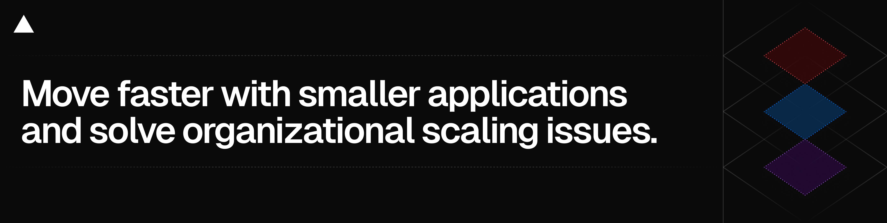

# @vercel/microfrontends

Split apart large applications and develop faster with microfrontends. This package contains library code to be used with Vercel's [microfrontends support](https://vercel.com/docs/microfrontends).

- **Improved developer velocity**: Build and test just the application that you are developing. Independent applications allow each team to choose their own technology stack.
- **Incremental migrations**: Gradually migrate systems to modern frameworks without rewriting everything at once.

See the [full documentation](https://vercel.com/docs/microfrontends) and [examples](https://vercel.com/templates/microfrontends) to learn more.

## Changelog

See the [changelog](./packages/microfrontends/CHANGELOG.md) for a list of changes.

## Getting Started

Follow the [quickstart](https://vercel.com/docs/microfrontends/quickstart) documentation to get started.

## Frameworks support

You can use the frameworks and microfrontends frameworks of your choice. `@vercel/microfrontends` supports Next.js, SvelteKit, React Router, Vite, and React.

## Need help?

Reach out for help in the [Vercel Community](https://community.vercel.com).
